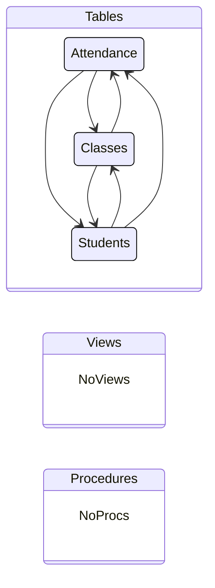

## dab-config.json

&nbsp;

### Tables
|Entity|Source|Relationships
|-|-|-
|Attendance|dbo.Attendance|Classes, Students
|Classes|dbo.Classes|Attendance, Students
|Students|dbo.Students|Classes, Attendance

### Views
> None

### Stored Procedures
> None

